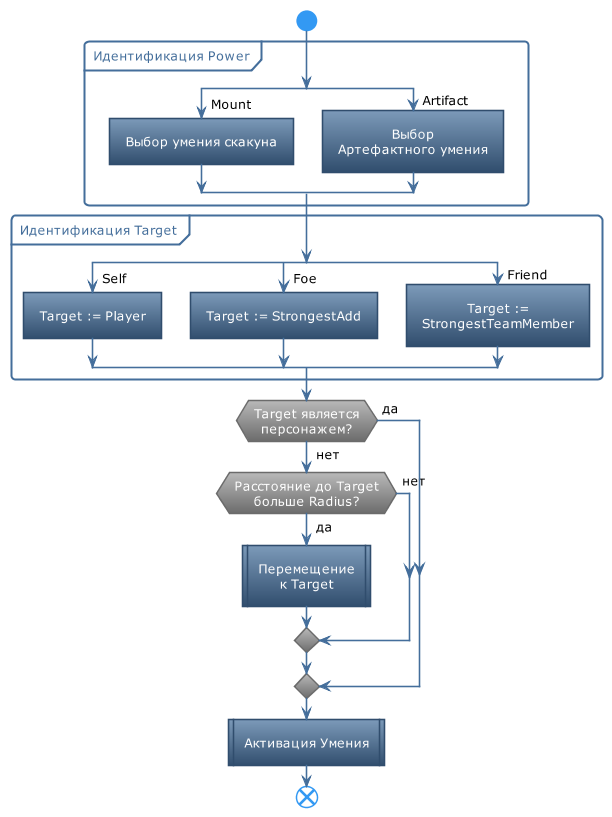

# **PluggedSkill**

Команда предназначена для активации боевого умения скакуна или артефакта, установленного в основной слот. Экипировка артефакта добавляет персонажу новое умение, поэтому его механизм его активации не отличается от использования умений персонажа, называемых *Power*.  
Особенностью команды ***PluggedSkill*** является то, что в зависимости от экипированного предмета она автоматически определяет идентификатор умения (PowerId), цель умения (Target), а также основные параметры (расстояние до цели, область действия и т.д.).

## **Описание алгоритма**

1. Выбор умения *Power*, в зависимости от [*Source*](#ref-Source).
2. Выбор цели умения (*Target*), в зависимости от характеристик умения *Power*:
   - *Self* : контролируемый ботом персонаж (*Player*);
   - *Foe* : наиболее сильный противник (*StrongestAdd*); 
   - *Friend* : наиболее сильный союзник (*StrongestTeamMember*).
3. Перемещения персонажа к цели на расстояние активации умения *Power;
4. Активация умения *Power.

---

# **Настройки команды**

| **Наименование** | **Описание** 
|:-----------------|:-------------
|<a name ="ref-Source">***Source***</a> | Переключатель, определяющий какое умение должно быть активировано: - ***Artifact*** : Артефакт, экипированный в основной слот; - ***Mount*** : Боевое умение скакуна.
|<a name ="ref-CustomConditions">***CustomConditions***</a> | Набор нестандартных UCC-условий.

---

# **Внутренние условия**

Команда не активирует артефакты, приносящие максимальную пользу вне боя:
- Каталог "Аврора для всех миров";
- Молот Гонда.
Кроме того, умения, целью которых является персонаж, не будут активированы, если рядом с ним нет ни одного противника.

---

# **Блок-схема**

---

# **Аналоги**

Для команды ***PluggedSkill : Mount*** в базовом функционале бота отсутствуют команды-аналоги.  
В отличие от неё штатная команда ***Skill*** не может активировать умение скакуна из-за встроенных ограничений.

Ближайшими аналогами команды ***PluggedSkill : Artifact*** являются:
- ***Special : Artifact*** является оберткой над консольной внутриигровой командой ``InventoryExec ArtifactPrimary`` и не может корректно определить цель умения.
- ***Skill*** требует детальной настройки и указания идентификатора умения *PowerId*, из-за чего для активации разных артефактов нужно добавлять разные команды.

Артефакт и умение скакуна можно активировать командой [***SpecializedUCCAction***](SpecializedUCCAction-RU.md), для которой требуется указать идентификатор умения [*PowerId*](SpecializedUCCAction-RU.md#ref-PowerId), из-за чего для каждого такого умения необходимо добавить отдельную команду.

---

[**Вернуться к перечню команд**](../EntityTools-UccExtensions-RU.md)