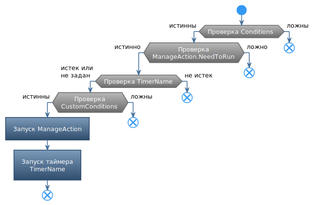

# **SpecializedUCCAction**

Основное назначение данной команды в том, чтобы  обрабатывать расширенный набор *ucc-условий* реализованных в плагине. В случае их выполнения запускается вложенная команда [*ManagedAction*](#ref-ManagedAction).
<!-- Команда содержит два набора условий:
1. ***Conditions*** : набор стандартных условий, отображаемых в *ucc-редакторе* на вкладке [*Conditions*](https://www.neverwinter-bot.com/forums/viewtopic.php?p=43910#p43910);
2. ***CustomConditions*** : расширенный набор условий, позволяющий использовать одновременно стандартные и дополнительные *ucc-условия*, реализованные в плагине. Указанные условия условия доступны в свойстве [*CustomConditions*](#ref-CustomConditions). -->

Предусмотрена возможность после выполнения команды запустить [именованный таймер](#ref-TimerName), до истечения которого повторный запуск команды невозможен. Один и тот же таймер можно использовать с разными командами, в результате чего запуск одной из таких команд блокирует запуск остальных до истечения указанного таймера.

## **Описание алгоритма**

Перед запуском [*ManagedAction*](#ref-ManagedAction) последовательно проверяются:
1. Список стандартных ucc-условий *Conditions*;
2. Встроенные условия запуска [*ManagedAction*](#ref-ManagedAction);
3. Окончания таймаута, заданного именованным таймером [*TimerName*](#ref-TimerName);
<!-- 4. Расширенный список ucc-условий [*CustomConditions*](#ref-CustomConditions). -->

---

# **Настройки команды**

| **Наименование** | **Описание** 
|:-----------------|:-------------
||**Категория "Managed Action"**
|<a name ="ref-ManagedAction">***ManagedAction***</a> | Основная ucc-команда, которой транслируется вызов. Могут использоваться как встроенные в Astral ucc-команды, так и любые другие команды, реализованные в плагиназх.
|<a name ="ref-LogicRule">***LogicRule***</a> | Логическое правило, в соответствии с которым проверяются вложенные условия: - ***Conjunction*** : Конъюнкция - логическое 'И', при котором *UCCConditionPack* истинно, если истинны все вложенные ucc-условия; - ***Disjunction*** : Дизъюнкция, т.е. логическое 'ИЛИ', при котором *UCCConditionPack* истинно, если истинно хотя бы одно из вложенных ucc-условий, не отмеченных флагом *Locked*; Следует отметить, что все условия с установленным флагом ***Locked***, должны быть истины, независимо от значения [*TestRule*](#ref-TestRule).  При обработке данного условия отсутствует [*баг Астрала*](https://www.neverwinter-bot.com/forums/viewtopic.php?p=43910#p43910 "Описан в 'Примере 4'"), при котором ложной является проверка группы, состоящей только из залоченных условий и обработанных по правилу ``ИЛИ``.
|<a name ="ref-Not">***Not***</a> | Флаг отрицания. В случае установки меняет результат проверки на противоположный.
||**Специальный именованный таймер (категория "SpecificTimer")**
|<a name ="ref-TimerName">***TimerName***</a> | Название таймера
|<a name ="ref-Timeout">***Timeout***</a> | Длительность таймера в миллисекундах
<!-- ||**Категория "Custom Conditions"**
|<a name ="ref-CustomConditions">***CustomConditions***</a> | Расширенный список ucc-условий, редактируемый в [отдельном окне](../UccConditionListEditor-RU.md). -->

---

# **Внутренние условия**

Команда не выполняется, если не задано [*ManagedAction*](#ref-ManagedAction).

---

# **Блок-схема**

---

# **Аналоги**

В базовом функционале бота похожие команды отсутствуют.

---

<a href="javascript:history.back()">Назад</a>  
[Назад к перечню команд](../EntityTools-UccExtensions-RU.md#ref-Actions)  
[Назад к содержанию](../../index.md)