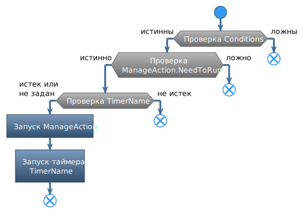

# **UCCActionPack**

Команда предназначена для объединения нескольких *ucc-команд* в единую группу, которая может выполняться последовательно без прерывания [**БОЕВОГО ЦИКЛА**](../UccActionPlayer-RU.md).  

## **Описание алгоритма**

[Стандартный алгоритм обработки *ucc-профиля*](../UccActionPlayer-RU.md) предусматривает сброс состояния после успешной активации любой *ucc-команды*. После этого обработка набора команд *ucc-профиля* начинается с начала (с первой).  
В отличие от описанного порядка команда **UCCActionPack** последовательно выполняет все сгруппированные в ней *ucc-команды* и не перезапускает **БОЕВОЙ ЦИКЛ** после первой успешной активации вложенной *ucc-команды*. Данное поведение регламентируется опцией [*ExecuteSequentially*](#ref-ExecuteSequentially).  
Команда **UCCActionPack** считается успешно активированной, если выполнена хотя бы одна вложенная *ucc-команда*.

---

# **Настройки команды**

| **Наименование** | **Описание** 
|:-----------------|:-------------
||**Основные  (категория "Main")**
|<a name ="ref-Name">***Name***</a> | Название команды, отображаемое вместо значения по умолчанию.|
||**Расширенные  (категория "Advanced")**
|<a name ="ref-Cooldown">***Cooldown (ms)***</a> | Период времени в миллисекундах между последовательными активациями команды.  Значение по умолчанию ``0`` предписывает боту определять кулдаун автоматически.|
|<a name ="ref-Enabked">***Enabked***</a> | Признак активности команды. При значениий ``False`` команда деактивируется и не применяется.|
|<a name ="ref-Disjunction">***Only one condition mast be good***</a> | Признак, меняющий логическое правило проверки прикрепленных к команде *ucc-условий*: **False** - для активации команды все условия должны быть истинны (Логичское ``И``); **True** - для активации команды достаточно, чтобы истинным было хотя бы одно незалоченное *ucc-условие** (у которого флаг ``Locked = False``), а также все залоченные *ucc-условия* (Логичское ``ИЛИ``).|
|<a name ="ref-Timer">***Timer (ms)***</a> | Период времени в миллисекундах, в течение которого персонаж бездействует после актиации команды.|
||**Дополнительные  (категория "Optional")**
|<a name ="ref-ExecuteSequentially">***ExecuteSequentially***</a> | Признак, определяющий порядок выполнения вложенных *ucc-команд*: **True** (значение по умолчанию) - включает принудительное выполнение всех вложенных *ucc-команды*, при котором они анализируются и выполняются последовательно, независимо от результатов активации предыдущей. В этом случае активация вложенной *ucc-команды* не прерывает **БОЕВОЙ ЦИКЛ** и не запускает обработку набора команд ucc-профиля с начала (с первой команды; **False** - отключает принудительное выполнение вложенных *ucc-команд*, что приводит к перезапуску **БОЕВОГО ЦИКЛА** после выполнения любой вложенной *ucc-команды*, что соответствует стандартному алгоритму обработки *ucc-профиля* боевой подсистемой бота (UCC).|

<!-- ## **Название группы настроек  (категория "Название категории")**

- ***Название_опции*** - описание опции.
  + *варинат значения опции* : Описание назначения .

---

# **Внутренние условия**

---

# **Блок-схема**

---

# **Аналоги**

Похожие команды, входящие в базовый функционал бота:
- ***Название_аналога***
-->

---

<a href="javascript:history.back()">Назад</a>  
[Назад к перечню команд](../EntityTools-UccExtensions-RU.md#ref-Actions)  
[Назад к содержанию](../../index.md)