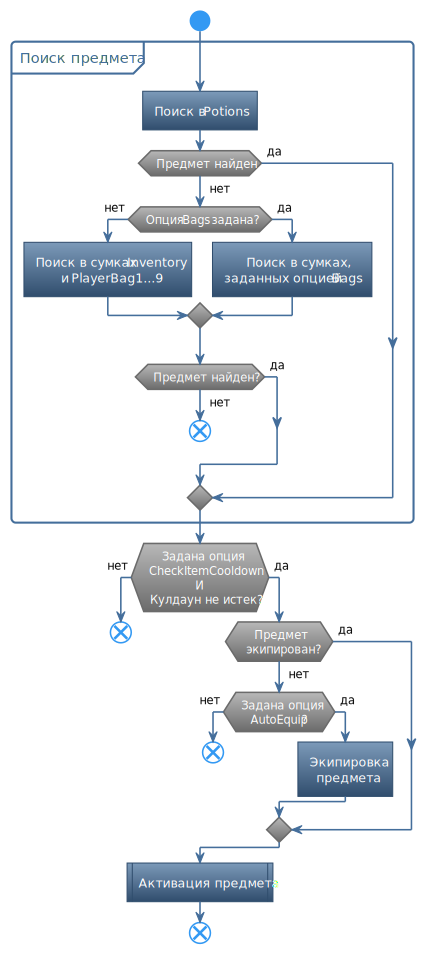

# **UseItemSpecial**

Команда предназначена для использования (активации) предмета, заданного группой опций (*Item*)[#ref-Item-Category].  
Заданный предмет может быть использован не только из ячейки пояса, но и из инвентаря персонажа, если механика игры это позволяет.

## **Описание алгоритма**

1. Поиск заданного предмета:
   1. Сначала проверяются ячейки быстрого доступа (сумка *Potions*);
   2. Если предмет не обнаружен, то проверяются сумки, заданные опцией [*Bags*](#ref-Bags);
   3. Если предмет не обнаружен - команда пропускается.  
   
   Результаты поиска кэшируются.
2. Если задана опция [*CheckItemCooldown*](#ref-CheckItemCooldown), тогда проверяется встроенный кулдаун.  
   Если кулдаун не истек - команда пропускается.
3. Если предмет находится в ячейке быстрого доступа, он активируется и команда завершается.
4. Если предмет может быть использован только в экипированном состоянии и задана опция [*AutoEquip*](#ref-AutoEquip), - предмет экипируется и активируется.   

---

# **Настройки команды**

| **Наименование** | **Описание** 
|:-----------------|:-------------
||**Группа настроек, идентифицирующих предмет (категория "Item")**
|<a name ="ref-ItemId">***ItemId***</a> | Текстовый идентификатор предмета.
|<a name ="ref-ItemIdType">***ItemIdType***</a> | Переключатель способа интерпретации [*ItemId*](#ref-ItemId): - ***Simple*** : Простая текстовая строка.  В начале и в конце строки допускается использование символа подстановки ``"*"``, заменяющего произвольное число алфавитно-цифровых символов; - ***Regex*** : Регулярное выражение, составленное по правилам [.Net Framework](https://docs.microsoft.com/ru-ru/dotnet/standard/base-types/regular-expressions).
|<a name ="ref-Bags">***Bags***</a> | Набор сумок персонажа, в которых будет производиться поиск предмета. По умолчанию заданы сумки: - ***Potions*** : пояс персонажа, содержащий 3 (три) ячейки быстрого доступа. - ***Inventory*** : первая (фиксированная) сумка инвентаря. - ***PlayerBag1~PlayerBag9***: дополнительные сумки инвентаря.
||**Дополнительные настройки (категория "Optional")**
|<a name ="ref-CheckItemCooldown">***CheckItemCooldown***</a> | Флаг, указывающий на необходимость проверки встроенных *кулдаунов*, то есть периодов времени в течение которого, запрещено повторное использование предмета. Предметы разделены на несколько групп, имеющих общие *кулдауны*, например, "зелья".
|<a name ="ref-AutoEquip">***AutoEquip***</a> | Флаг, указывающий на необходимость экипировать предмет перед использованием.

---

# **Блок-схема**

---

# **Аналоги**

Похожие команды, входящие в базовый функционал бота:
- ***Consumables***

---

<a href="javascript:history.back()">Назад</a>  
[Назад к перечню команд](../EntityTools-UccExtensions-RU.md#ref-Actions)  
[Назад к содержанию](../../index.md)