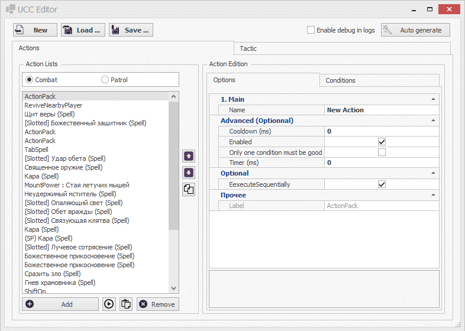
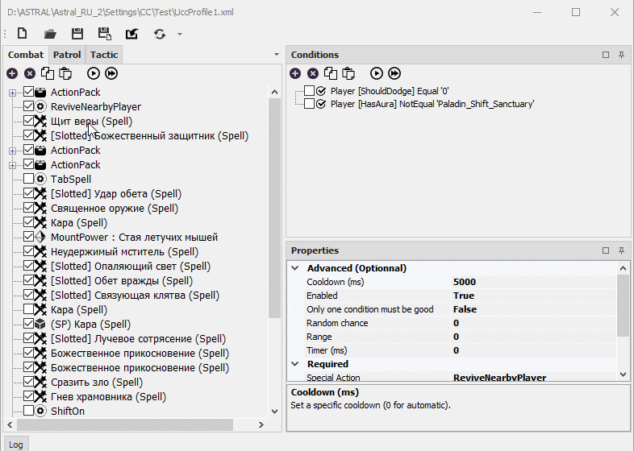

# **Модифицированный редактор ucc-профиля**

По умолчанию Astral может использовать умения персонажей, но делает это не всегда оптимальным образом.  
Чтобы это изменить, нужно создать персональный боевой профиль UniversalCombatClass (*ucc-профиль*) - набор *ucc-команд*, которые активируют Свободные, Боевые и Ежедневные умения персонажа, Артефакт, Улонения, разлчные Предметы из ячеек пояса, а также некоторые специальные действия (например, "Приблизиться в милизону"). Кроме того, персональный *ucc-профиль* позволяет также модифицировать тактику ведения боя, изменить приоритет выбора целей и т.д.

**UCC Editor (или UCC-редактор)** - это специальный инструмент для создания UCC-профиля.

В плагине **EntityTools** реализован модифицированный *UCC-редактор*, который с помощью патча заменяет [штатный *UCC-редактор*](https://www.neverwinter-bot.com/forums/viewtopic.php?f=150&t=8020&sid=f61597913fbb61bf4fb7b95e57526dff) бота Астрал.

<!-- |Штатный UCC-редактор|Модифицированный UCC-редактор|
|:------------:|:------------:|
||| -->

**Штатный UCC Editor**  
<p align="center"></p>

**Модифицированный UCC Editor**
<p align="center"></p>

## **Отличия модифицированного UCC-редактора от штатного**

1) Возможность использования дополнительных [*ucc-команд*](../EntityTools-UccExtensions-RU.md#ref-Actions) и [*ucc-условий*](../EntityTools-UccExtensions-RU.md#ref-Conditions), реализованных в плагине, таких как [*PluggedSkill*](../Actions/PluggedSkill-RU.md), [*UCCEntityCheck*](../Conditions/UCCEntityCheck-RU.md) и др.  
   Штатный ***UCC Editor*** может использовать только стандартные ucc-команды и ucc-условия.

2) Возможность создания иерархической (древовидной) структуру ucc-профиля и ucc-команд благодаря специальной группирующей ucc-команде [*UCCActionPack*](../Actions/UCCActionPack-RU.md) и группирующему условияю [*UCCConditionPack*](../Conditions/UCCConditionPack-RU.md). Дерево команд и условий отображается непосредственно в интерфейсе редактора и поддерживает модификацию с *Drag and Drop*.  
   Штатный ***UCC Editor*** предназначен для работы исключительно с линейными списками ucc-команд и ucc-условий. *Drag and Drop* не поддерживается.

3) Лаконичный адаптивный интерфейс, который можно настроить под свои потребности, перемещая панели в удобное место окна (присоединенные панели) или рабочего стола (плавающие панели), скрывая их, или настраивая всплытие при наведении курсора мыши. Настройка редактора сохраняется между сеансами в файл:  
   ```Astral_Folder\Settings\EntityTools\UccEditor.xml ```  
   Штатный ***UCC-редактор*** имеет неизменный интерфейс и плохо адаптируется к изменению размера окна, которое приводит к наложению элементов интерфейса друг на друга.

4) Мгновенный отклик и обновление интерфейса при изменение структуры *ucc-профиля*.  
   Штатный ***UCC-редактор*** при работе с длинным списком ucc-команд (15 и более) имеет заметную задержку при его обновлении после изменения свойств выбранной команды или перемещении её на вышестоящую или нижестоящую позицию.

5) Возможность редактирования отдельного ucc-профиля, не связанного с активным ucc-профилем текущего персонажа. Окно ***UCC-редактора*** не является модальным и не блокирует интерфейс Astral'a.  
   Штатный ***UCC-редактор*** предназначен исключительно для редактирования  активного ucc-профиля текущего персонажа и работает в режиме модельного окна, т.е. блокирует интерфейс Astral'a. Такая реализация может приводить к неприятным эффектам, если при редактировании ucc-профиля произойдет смена персонажа и загрузка нового *ucc-профиля*. В этом случае несохраненные изменения будут утрачены.

6) Наличие панели логирования (Log), в которую выводится информация о совершенных действиях и результатах тестов *ucc-команд* и *ucc-условий*.

---

## <a name="ref-ActionPanels"></a>**Панели Combat и Patrol**

- **Панель Combat** содержит набор [*ucc-команд*](../EntityTools-UccExtensions-RU.md#ref-Actions), управляющих действиями персонажа во время боя.  
  Сюда необходимо поместить команды активации свободных, боевых и ежедневных умения, использвания артефактов, зелий и т.п.
- **Панель Patrol** содержит набор [*ucc-команд*](../EntityTools-UccExtensions-RU.md#ref-Actions), периодически активируемых в режиме патрулирования, то есть во время всех действий, не связанных с боем.  
  Сюда целесообразно помещать [*ucc-команды*](../EntityTools-UccExtensions-RU.md#ref-Actions), предназначенные для подготовки к бою, например, для наложения бафов, восстановления здоровья/стамины и т.п.

В **EntityTools** реализована специальная группирующая команда [*UCCActionPack*](../Conditions/UCCActionPack-RU.md), позволяющая объединить несколько [*ucc-команд*](../EntityTools-UccExtensions-RU.md#ref-Actions) и выполнять их как единую непрерывную последовательность. Упрощенное описание алгоритма обработки дерева [*ucc-команд*](../EntityTools-UccExtensions-RU.md#ref-Actions) боевой подсистемой бота описано в [*отдельной статье*](../UccActionPlayer-RU.md).  

Изменение порядка (структуры) и перегруппировка [*ucc-команд*](../EntityTools-UccExtensions-RU.md#ref-Actions) производится путем перетакивания (*Drag and Drop*) с зажатой левой кнопкой мыши (ЛКМ). При перетаскивании с зажатой правой кнопкой мыши (ПКМ), [*ucc-команда*](../EntityTools-UccExtensions-RU.md#ref-Actions) копируется.  
По умолчанию [*ucc-команда*](../EntityTools-UccExtensions-RU.md#ref-Actions), переремещаемая на [*UCCActionPack*](../Actions/UCCActionPack-RU.md), вставляется в начало списка вложенных [*ucc-команды*](../EntityTools-UccExtensions-RU.md#ref-Actions). Однако при удержании кнопки ``ALT`` [*ucc-команда*](../EntityTools-UccExtensions-RU.md#ref-Actions) будет помещена ПОСЛЕ [*UCCActionPack*](../Conditions/UCCActionPack-RU.md)'а.  

Кроме того, добавление, удаление, копирования в ставка [*ucc-команд*](../EntityTools-UccExtensions-RU.md#ref-Actions) в(из) набора и буфера обмена возможно с помощью кнопок, расположенных над соответствующим набором, а также с помощью сочетания кнопок:
- ``Ctrl+C`` - копирование;
- ``Ctrl+V`` - вставка;
- ``Ctrl+Del`` - удаление;
- ``Ins`` - добавление.

---

## <a name="ref-ConditionsPanels"></a>**Панель Conditions**

Данная панель содержит набор [*ucc-условий*](../EntityTools-UccExtensions-RU.md#ref-Conditions), присоединенных к [*ucc-команде*](../EntityTools-UccExtensions-RU.md#ref-Actions), выбранной на панели [*Combat* или *Patrol*](#ref-ActionPanels).  
В **EntityTools** реализовано специальное группирующее условие [*UCCConditionPack*](../Conditions/UCCConditionPack-RU.md), позволяюще объединить несколько [*ucc-условий*](../EntityTools-UccExtensions-RU.md#ref-Conditions), и таким образом формировать сложные логические условия активации [*ucc-команды*](../EntityTools-UccExtensions-RU.md#ref-Actions), к которой они относятся.  

Изменение порядка (структуры) и перегруппировка [*ucc-условий*](../EntityTools-UccExtensions-RU.md#ref-Conditions) производится путем перетакивания (*Drag and Drop*) с зажатой левой кнопкой мыши (ЛКМ). При перетаскивании с зажатой правой кнопкой мыши, [*ucc-условие*](../EntityTools-UccExtensions-RU.md#ref-Conditions) копируется.  
По умолчанию [*ucc-условие*](../EntityTools-UccExtensions-RU.md#ref-Conditions), перемещаемое на [*UCCConditionPack*](../Conditions/UCCConditionPack-RU.md), добавляется в начало списка вложенных [*ucc-условий*](../EntityTools-UccExtensions-RU.md#ref-Conditions). Однако, при удержании кнопки ``ALT`` [*ucc-условие*](../EntityTools-UccExtensions-RU.md#ref-Conditions) будет помещено ПОСЛЕ [*UCCConditionPack*](../Conditions/UCCConditionPack-RU.md)'а.  

Кроме того, добавление, удаление, копирования в ставка [*ucc-условий*](../EntityTools-UccExtensions-RU.md#ref-Conditions) в(из) набора и буфера обмена возможно с помощью кнопок, расположенных над ним, а также с помощью сочетания кнопок:
- ``Ctrl+C`` - копирование;
- ``Ctrl+V`` - вставка;
- ``Ctrl+Del`` - удаление;
- ``Ins`` - добавление.

---

## <a name="ref-PropertiesPanel"></a>**Панель Properties**

Данная панель отображает настройки (опции) выбранной [*ucc-команды*](../EntityTools-UccExtensions-RU.md#ref-Actions) или [*ucc-условия*](../EntityTools-UccExtensions-RU.md#ref-Conditions).

---

## <a name="ref-TacticPanel"></a>**Панель Tactic**

Эта панель предназначена для настройки особенностей поведения персонажа в бою, такие как условия использования зелий исцеления и правила переключения целей (Target Priority).

Изменение порядка приоритета целей *Target Priorities* производится путем перетаскивания (Drag & Drop) с зажатой левой кнопкой мыши (ЛКМ).  
Кроме того, добавление, удаление, копирования в ставка ** в(из) дерева и буфера обмена возможно с помощью кнопок, расположенных над соответствующим деревом, а также с помощью сочетания кнопок:
- ``Ctrl+C`` - копирование;
- ``Ctrl+V`` - вставка;
- ``Ctrl+Del`` - удаление;
- ``Ins`` - добавление.

---

## <a name="ref-LogPanel"></a>**Панель Log**

На указанной панели в хронологическом порядке выводится информация о совершенных в редакторе действия.

---

## <a name="ref-ToolsPanels"></a>**Панели инструментов**

- **Панель управления профилем** содержит кнопки сохранения, загрузки и обновления, экспорта *ucc-профиля*. Данная панель может быть прикреплена к любой из границ окна, а также размещена в произвольном месте рабочего стола.  
- **Панель управления ucc-командами** закреплена внутри панелей [*Combat* или *Patrol*](#ref-ActionPanels) и содержит кнопки для добавления, удаления, копирования выделенной команды в буфер обмена и вставки из него, а также тестирования *ucc-команд(ы)*.  
- **Панель управления ucc-условиями** закреплена внутри панели [*Conditions*](#ref-ConditionsPanels) и содержит кнопки для добавления, удаления, копирования выделенного условия в буфер обмена и вставки из него, а также тестирования *ucc-условия(ий)*.

---

<a href="javascript:history.back()">Назад</a>  
[Назад к содержанию](../index.md)