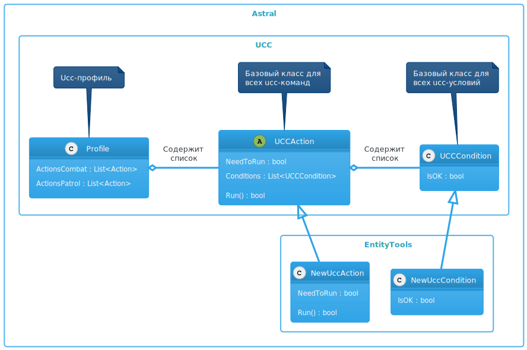

# **Расширение для [*Universal Combat Class*](../General/Glossary-RU.md#ref-UCC)**

**Universal Combat Class** (Далее - *UCC*) - это [подсистема](https://www.neverwinter-bot.com/forums/viewtopic.php?f=150&t=8020) бота [***Astral***](https://www.neverwinter-bot.com/forums/index.php), управляющая действиями персонажа во время боя. Упрощенное описание алгоритма функционирования боевой подсистемы описано в [*отдельной статье*](UccActionPlayer-RU.md).  
Каждое свободное, боевое и ежедневное умение персонажа активируется специальной командой (Далее - "*ucc-команда*" или "*ucc-Action*"). Также существуют специальные ucc-команды на уклонение, приближение или удаление от цели, переключение режима боя и т.п.

Последовательность и условиям применения *ucc-команд* называются *ucc-профиль*, который сохраняется в *xml-файл*.

В случае отсутствия *ucc-профиля* для класса, которым бот управляет в данный момент, **UCC** автоматически генерирует *ucc-профиль*, содержащий минимально необходимый набор *ucc-команд*. Однако, бот в автоматическом режиме не способен выстроить комбинированные атаки и реализовать специфическую для класса тактику боя.

Профили создаются в [специальном редакторе](Editor/UccEditor-RU.md), улучшенная версия которого реализована в плагине **EntityTools**.

Кроме того в состав плагина **EntityTools** входят дополнительные *ucc-команды* и *ucc-условия*, которые могут быть использованы в *ucc-профилях*, а также инструменты для их настройки.  
Разработчиками бота не была предусмотрена возможность добавления *ucc-команд* и *ucc-условий* в плагинах. Чтобы обойти данное ограничение в **EntityTools** реализованы:

- патч, модифицирующий окно добавления *ucc-команд*, в котором реализована возможность выбора стандартный и дополнительных *ucc-команды*.
- патч метода проверки истинности *ucc-условий*, позволяющий боевой подсистеме обрабатывать дополнительные *ucc-условия* вместе со стандартными.  
   <small>*В версии плагина **EnttyTools** 0.22.629.330 и младше для данных целей использовалась специальная команда-обертка [SpecializedUCCAction](Actions/SpecializedUCCAction-RU.md), которая в настоящий момент является устаревшей.*</small>.
- улучшенный [редактор ucc-профилей](Editor/UccEditor-RU.md).

---

---

## **Команды**

1. [UCCActionPack](Actions/UCCActionPack-RU.md) : группирующая *ucc-команда*, позволяющая выполнять ucc-команды последовательно (без перерыва).
[SpecializedUCCAction](Actions/SpecializedUCCAction-RU.md) : команда-обертка, обрабатывающая расширенный набор *ucc-условий*.
2. [ExecuteSpecificPower](Actions/ExecuteSpecificPower-RU.md) : команда для активации умения персонажа или используемого предмета, c дополнительными настройки.
3. [PluggedSkill](Actions/PluggedSkill-RU.md) : активирует артефакт или боевое умение скакуна.
4. [ChangeTarget](Actions/ChangeTarget-RU.md) : заменяет цель персонажа на противника, заданного командой.
5. [ApproachEntity](Actions/ApproachEntity-RU.md) : перемещает персонажа к заданной *Entity*.
6. [DodgeFromEntity](Actions/DodgeFromEntity-RU.md) : перемещает персонажа от заданной *Entity*.
7. [UseItemSpecial](Actions/UseItemSpecial-RU.md) : активация заданного предмета.

---

## **Условия**

1. [UCCConditionPack](Conditions/UCCConditionPack-RU.md) : группирующее ucc-условие.
2. [UCCEntityCount](Conditions/UCCEntityCount-RU.md) : подсчет количества *Entity* и сопоставление с заданной величиной.
3. [UCCEntityCheck](Conditions/UCCEntityCheck-RU.md) : проверка заданного свойства *Entity*.
4. [UCCTargetMatchEntity](Conditions/UCCTargetMatchEntity-RU.md) : проверка цели на сооответствия заданному идентификатору *Entity*.
5. [UCCCheckTimer](Conditions/UCCCheckTimer-RU.md) : проверка состояния именованного таймера.
6. [UCCGameUICheck](Conditions/UCCGameUICheck-RU.md) : проверка состояния заданного элемента внутриигрового интерфейса.
7. [UCCQuesterCheck](Conditions/UCCQuesterCheck-RU.md) : условие-обертка, которое позволяет использовать любые [quester-условия](http://www.neverwinter-bot.com/forums/viewtopic.php?f=150&t=7892&start=10#p43910).

---

## **Описание модифицированного [*редактора UCC-профилей*](Editor/UccEditor-RU.md)**

---

<a href="javascript:history.back()">Назад</a>  
[Назад к содержанию](../index.md)
