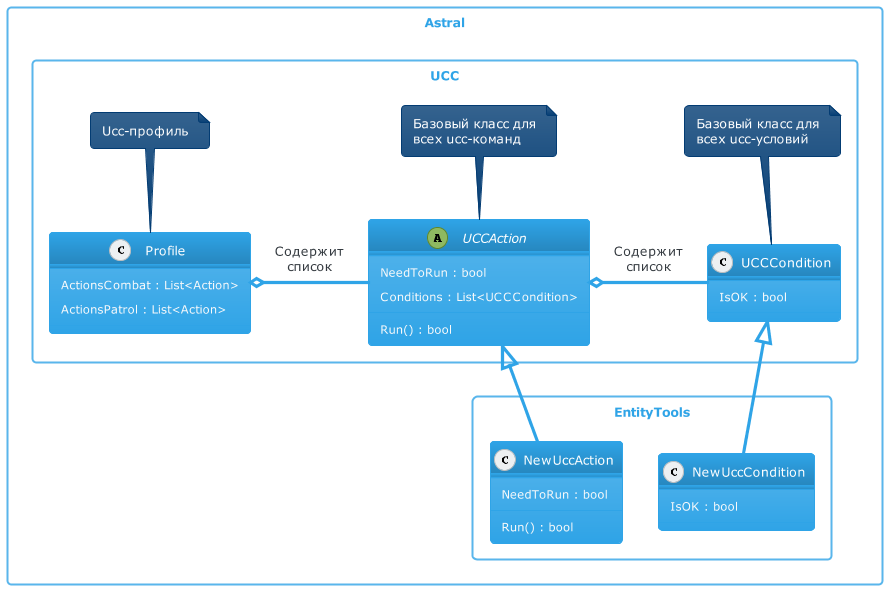

# **Расширение для [*Universal Combat Class*](../General/Glossary-RU.md#ref-UCC)**

**Universal Combat Class** (Далее - *UCC*) - это [подсистема](https://www.neverwinter-bot.com/forums/viewtopic.php?f=150&t=8020) бота [***Astral***](https://www.neverwinter-bot.com/forums/index.php), управляющая действиями персонажа во время боя.
Каждое свободное, боевое и ежедневное умение персонажа активируется специальной командой (Далее - "*ucc-команда*" или "*uccAction*"). Также существуют специальные ucc-команды на уклонение, приближение или удаление от цели, переключение режима боя и т.п.

Последовательность и условиям применения *ucc-команд* называются *ucc-профиль*, который сохраняется в *xml-файл*.

В случае отсутствия *ucc-профиля* для класса, которым бот управляет в данный момент, **UCC** автоматически генерирует *ucc-профиль*, содержащий минимально необходимый набор *ucc-команд*. Однако, бот в автоматическом режиме не способен выстроить комбинированные атаки и реализовать специфическую для класса тактику боя.

Профили создаются в специальном редакторе. Краткая инструкция по созданию *ucc-профилей* обупликована на  [*форуме*](https://www.neverwinter-bot.com/forums/viewtopic.php?f=150&t=8020).

Плагин **EntityTools** реализует дополнительные *ucc-команды* и *ucc-условия*, которые могут быть использованы в *ucc-профилях*, а также инструменты для их настройки.  
Разработчиками бота не была предусмотрена возможность добавления *ucc-команд* и *ucc-условий* в плагинах. Чтобы обойти данное ограничение в **EntityTools** реализованы:
- патч, заменяющий стандартное окно добавления *ucc-команд*, которое не отображало дополнительные *ucc-команд*;
- специальная команда-обертка [*SpecializedUCCAction*](Actions/SpecializedUCCAction-RU.md), которая может обрабатывать расширенный набор *ucc-условий* как входящих в стандартный набор бота, так и реализованных в плагине.

---

---

## **Команды**

1.  [SpecializedUCCAction](Actions/SpecializedUCCAction-RU.md) : команда-обертка, обрабатывающая расширенный набор *ucc-условий*.
2.  [PluggedSkill](Actions/PluggedSkill-RU.md) : активирует артефакт или боевое умение скакуна.
3.  [ChangeTarget](Actions/ChangeTarget-RU.md) : заменяет цель персонажа на противника, заданного командой.
4.  [ApproachEntity](Actions/ApproachEntity-RU.md) : перемещает персонажа к заданной *Entity*.
5.  [DodgeFromEntity](Actions/DodgeFromEntity-RU.md) : перемещает персонажа от заданной *Entity*.

---

## **Условия**
1. [UCCConditionPack](Conditions/UCCConditionPack-RU.md) : проверка группы вложенных ucc-условий.
2. [UCCEntityCount](Conditions/UCCEntityCount-RU.md) : подсчет количества *Entity* и сопоставление с заданной величиной.
3. [UCCEntityCheck](Conditions/UCCEntityCheck-RU.md) : проверка заданного свойства *Entity*.
4. [UCCTargetMatchEntity](Conditions/UCCTargetMatchEntity-RU.md) : проверка цели на сооответствия заданному идентификатору *Entity*.
5. [UCCCheckTimer](Conditions/UCCCheckTimer-RU.md) : проверка состояния именованного таймера.
6. [UCCGameUICheck](Conditions/UCCGameUICheck-RU.md) : проверка состояния заданного элемента внутриигрового интерфейса.
7. [UCCQuesterCheck](Conditions/UCCQuesterCheck-RU.md) : условие-обертка, которое позволяет использовать любые [quester-условия](http://www.neverwinter-bot.com/forums/viewtopic.php?f=150&t=7892&start=10#p43910).

---

<a href="javascript:history.back()">Назад</a>  
[Назад к содержанию](../index.md)