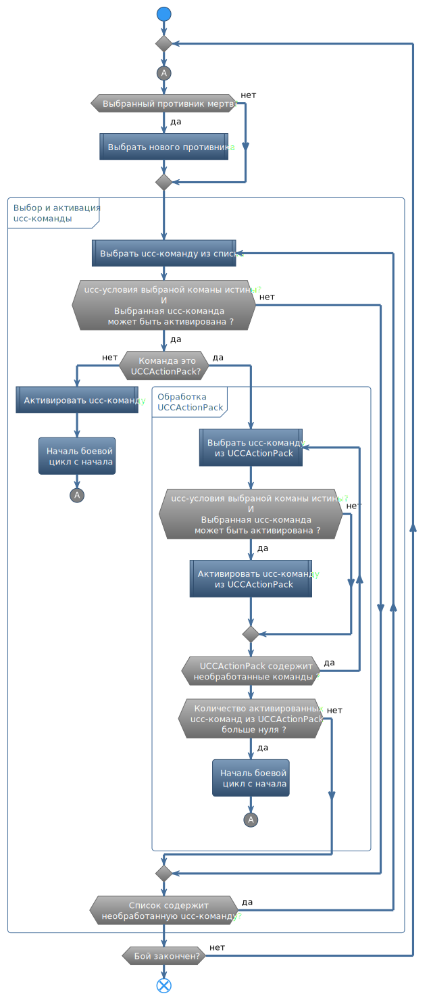

# **Алгоритм обработки UCC-профиля**

После вступления персонажа в бой и подсистемы [**Universal Combat Class**](https://www.neverwinter-bot.com/forums/viewtopic.php?f=150&t=8020) (Далее - *UCC*), бот перебирает набор *ucc-команд* сначала (сверху) до конца (вниз), и активирует их, если выполняются соответсвующие им условия. Перебор ucc-команд повторяется до тех пор, пока персонаж находится в бою. Это называется **БОЕВОЙ ЦИКЛ**.  

Откаты, дальность умения, наличие очков действия (ОД для Ежедневок) учитывается ботом самостоятельно и вносить их в список условий не нужно.

Если условия для выполнения *ucc-команды* выполняются, она активируется и бот начинает обработку списка с 1 команды, то есть **БОЕВОЙ ЦИКЛ** начинается с начала.
В противном случае *ucc-команда* пропускается и бот анализирует следующую.

Не изученные у данного персонажа умения помечаются в редакторе как "Unknown spell" и в бою пропускаются, также как неэкипированные умения (без префикса [Slotted]).

При выполнении команды [*UCCActionPack*](Actions/UCCActionPack-RU.md) для всех вложенных *ucc-команд* проверяются связанные с ними условия и производится попытка их активации. По умолчанию обработка последовательности вложенных команд не прерывается в результате успешной активации предыдущей *ucc-команды* как в обычном порядке, то есть **БОЕВОЙ ЦИКЛ** не прерывается и не начинается сначала.

Таким образом, самые важные *ucc-команды* **НЕОБХОДИМО** поместить в начале (сверху) набора (Ежедневные умения, Уклонения и умения защиты).  
*UCC-команды* не требующие соблюдения каких-либо условий (свободные умения) нужно размещать в конце набора, в противном случае персонаж зациклится на такой *ucc-команде* и следующие за ней никогда не будут применяться.

---

Пример обработки ucc-профиля боевой подсистемой бота приведен [здесь](UccActionPlayerExample-RU.md).

---

---

<a href="javascript:history.back()">Назад</a>  
[Назад к содержанию](../index.md)
