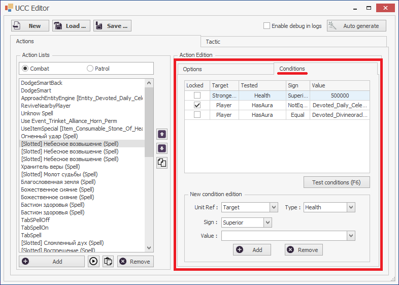
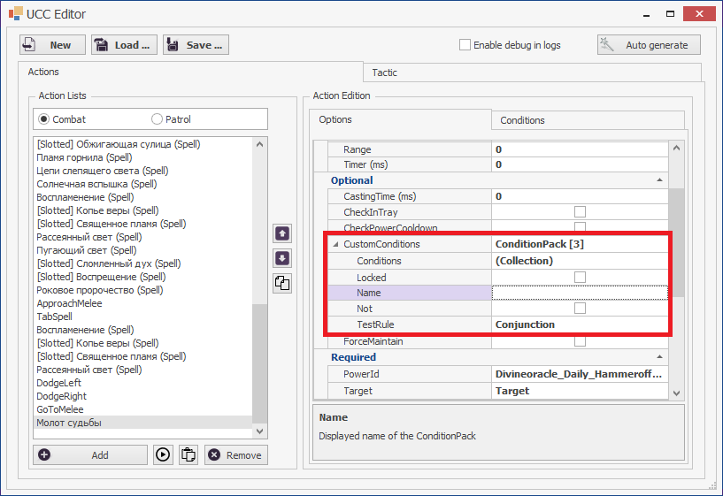
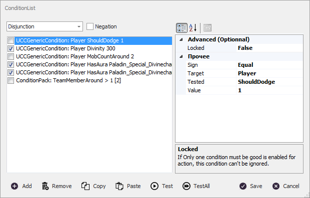
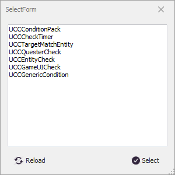
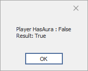
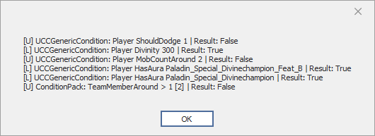

# **Модифицированный редактор коллекции ucc-условий**

## **Ограничения стандартного редактора**
Разработчики бота не предусмотрели возможность добавления *ucc-условий* в плагинах, поэтому их нельзя добавить в обычный набор условий ucc-команды (в красной рамке справа). 

Чтобы обойти данное ограничение ucc-командам, реализованным в плагине **EntityTools**, была добавлена опция ***CustomConditions***, являющаяся расширенной коллекцией ucc-условий.

***CustomConditions*** позволяет обрабатывать все типы ucc-условий, как встроенные в Астрал, так реализованные в плагине.
Кроме того, было реализовано ucc-условие [*UCCConditionPack*](Conditions/UCCConditionPack-RU.md), позволяющее группировать ucc-условия и формировать сложные логические правила. 

При обработке *CustomConditions* отсутствует [*баг Астрала*](https://www.neverwinter-bot.com/forums/viewtopic.php?p=43910#p43910 "Описан в 'Примере 4'"), при котором ложной является проверка группы, состоящей только из залоченных условий и обработанных по правилу ``ИЛИ``.

---

## **Модифицированный редактор**
Изменение коллекции ucc-условий производится в отдельном окне:

1. В левой части окна содержится список ucc-условий. 
2. В правой части окна - настройки выбранного слева ucc-условия.  
3. Все ucc-условия обрабатываются по логическому правилу, заданному в выпадающем списке в левом верхнем углу окна:
   - ***Conjunction*** : Конъюнкция (логическое 'И'), при котором группа условий истинна, если истинны все ucc-условия;
   - ***Disjunction*** : Дизъюнкция (логическое 'ИЛИ'), при котором группа условий истинна, если истинно хотя бы одно из ucc-условий, не отмеченных флагом *Locked*.
    Следует отметить, что все условия с флагом ***Locked***, должны быть истинны, независимо от выбранного логического правила. Для удобства такие условия отмечены в списке птичками ``v``.
4. Вверху слева устанавливается флаг отрицания *Negation*, который меняет результат проверки группы условий на противоположный.
5. В нижней части окна расположены кнопки:
   - **Add** : Добавляет новое ucc-условие в список. При нажатии на кнопку открывается окно со списком доступных ucc-условий, в котором нужно выбрать нужное и нажать на ``"Select"``.
       

    
   - **Remove** : Удаляет выбранное ucc-условие из списка.
   - **Copy** : Копирует в буфер обмена выбранное в списке ucc-условие.
   - **Paste** : Вставляет ucc-условие в список из буфера обмена.
   - **Test** : Тестирование выбранного ucc-условия. Результаты проверки отображаются в окне сообщений.  
       

  
   - **TestAll** : Тестирование всех ucc-условий из списка. Результаты проверки отображаются в окне сообщений.  
       

  
    Следует отметить, что команды копирования и вставки ucc-условий делят общий буфер обмена, что позволяет копировать условие в одном окне, и вставить его в другом.
---

<a href="javascript:history.back()">Назад</a>  
[Назад к содержанию](../index.md)