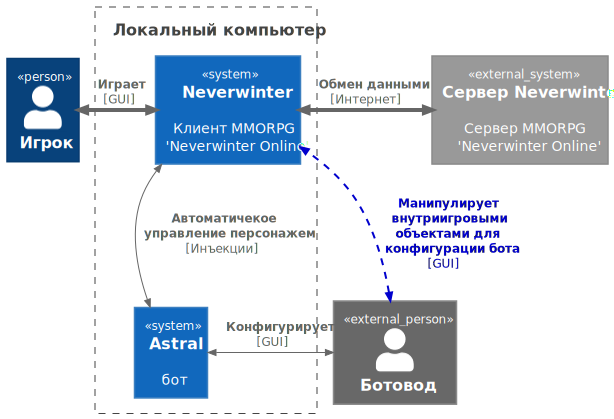
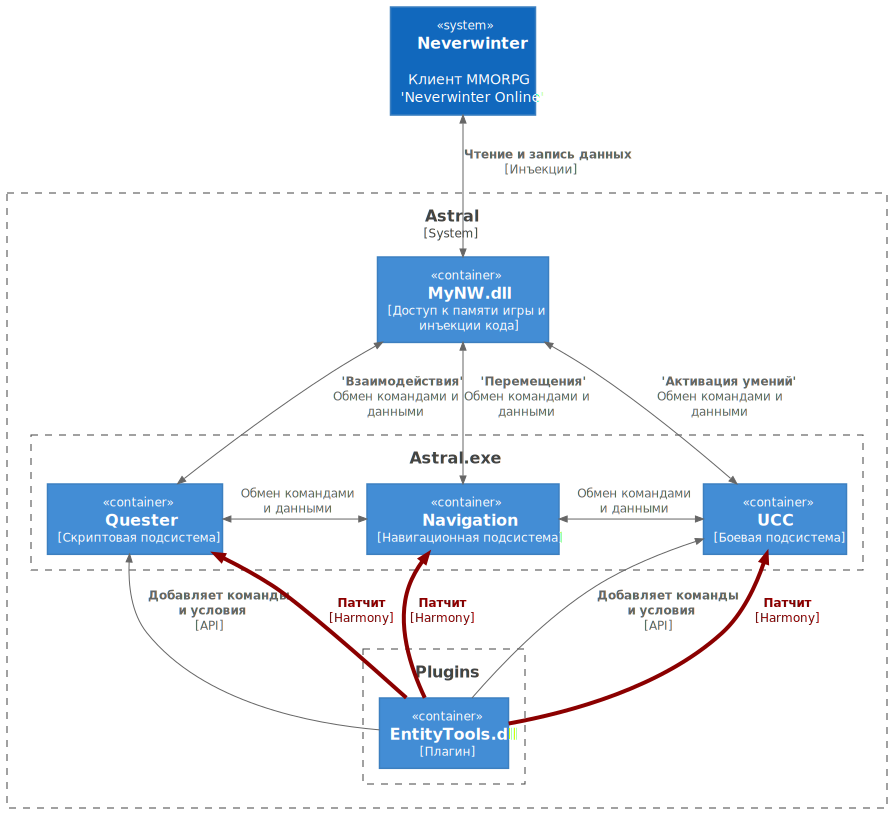

# **Описание**
**EntityTools** - это плагин для бота [Astral](https://www.neverwinter-bot.com/forums/index.php) к MMORPG ["Neverwinter Online"](https://www.arcgames.com/en/games/neverwinter/news).

Плагин добавляет новые команды и условия для использования в скриптах **Quester**'a - подсистемы бота, предназначенной для выполнения сюжетных заданий, прохождения подземелий и выполнения других сложных последовательностей действий. [*Подробнее...*](Quester/EntityTools-QuesterExtensions-RU.md)

Кроме того, плагин модифицирует боевую подсистему **UCC**, добавляя новые команды и условия, управляющие персонажем в бою. Например, возможность использования боевого умения скакуна. [*Подробнее...*](Ucc/EntityTools-UccExtensions-RU.md)

Более того, в плагине реализованы специальные инструменты для разработчиков скриптов для **Quester**'а. Некоторые инструменты заменяют стандартные, например, такие как Mapper, а другие используются для настройки новых команд и условий. [*Подробнее...*](Patches/Mapper/Mapper-RU.md)

Наконец, в плагине реализованы несколько [патчей](Patches/Overview-RU.md), исправляющих наиболее неприятные ошибки бота, или улучшающие его функционал.

## **Содержание**
### **1. [Расширения для *Quester'a*](Quester/EntityTools-QuesterExtensions-RU.md)**
### **2. [Расширения для *UCC*](Ucc/EntityTools-UccExtensions-RU.md)**
### **3. [Главная панель плагина](MainPanel/Overview-RU.md)**
### **4. Инструменты:**
- **Окно картографирования [Mapper](Patches/Mapper/Mapper-RU.md)** 
- **Модифицированный [UCC редактор](Ucc/Editor/UccEditor-RU.md)** 
- **Обозреватель аур [AuraViewer](MainPanel/AuraViewer-RU.md#ref-AuraViewer)**
- **Обозреватель Entities [EntityViewer](General/EntityIdentification-RU.md#ref-EntityViewer)**
- **Монитор миссий [MissionMonitor](MainPanel/MissionMonitor-RU.md)**
- **[EntityTool Logger](MainPanel/img/Utilites/Logger.png)**
<!-- - **[Редактор CustomRegionSet](General/CustomRegionSet-RU.md#ref-CustomRegionSet-Editor)** -->
<!-- - **[Помощник зачарования (EnchantHelper)](MainPanel/EnchantHelper-RU.md)**   -->

### **5. Фоновые сервисы:**
- **[SpellStuckMonitor](MainPanel/UnstuckSpells-RU.md)**
- **[SlideMonitor](MainPanel/img/Settings/SlideMonitor.png)**
- **[Quester Profile Preprocessing](MainPanel/QuesterProfilePreprocessing-RU.md)**

### **6. [Патчи](Patches/Overview-RU.md)**
