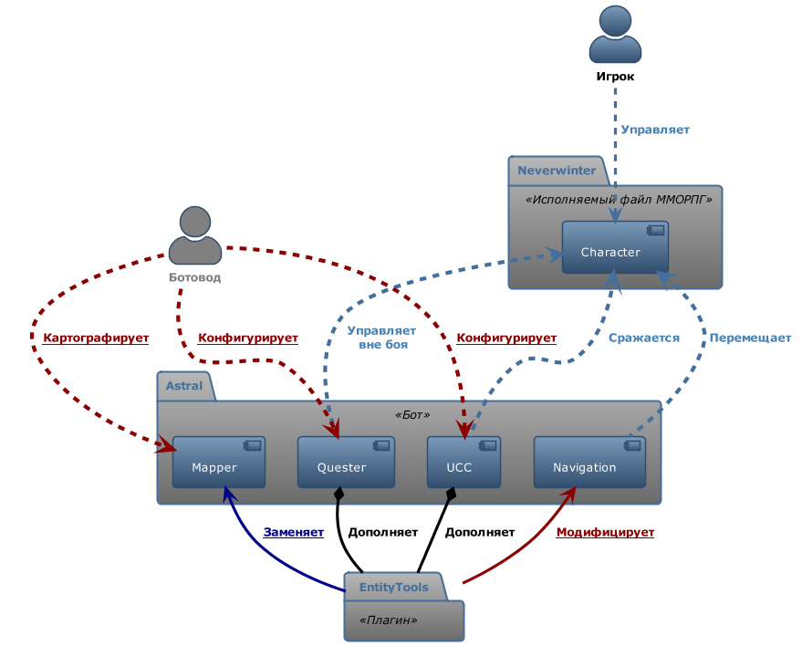

# **Описание**
**EntityTools** - это плагин для бота [Astral](https://www.neverwinter-bot.com/forums/index.php) к MMORPG ["Neverwinter Online"](https://www.arcgames.com/en/games/neverwinter/news).

Плагин добавляет новые команды и условия для использования в скриптах **Quester**'a - подсистемы бота, предназначенной для выполнения сюжетных заданий, прохождения подземелий и выполнения других сложных последовательностей действий. [*Подробнее...*](Quester/EntityTools-QuesterExtensions-RU.md)

Кроме того, плагин модифицирует боевую подсистему **UCC**, добавляя новые команды и условия, управляющие персонажем в бою. Например, возможность использования боевого умения скакуна. [*Подробнее...*](Ucc/EntityTools-UccExtensions-RU.md)

Более того, в плагине реализованы специальные инструменты для разработчиков скриптов для **Quester**'а, а также . Некоторые инструменты заменяют стандартные, например, такие как Mapper, а другие являются . [*Подробнее...*]()

Наконец, в плагине реализованы несколько патчей, исправляющих наиболее неприятные ошибки бота, или улучшающие его функционал.

## **Содержание**
### **1. [Расширения для *Quester'a*](Quester/EntityTools-QuesterExtensions-RU.md)**
### **2. [Расширения для *UCC*](Ucc/EntityTools-UccExtensions-RU.md)**
### **3. Инструменты:**
#### **3.1. [Mapper](Patches/Mapper/Mapper-RU.md)** 